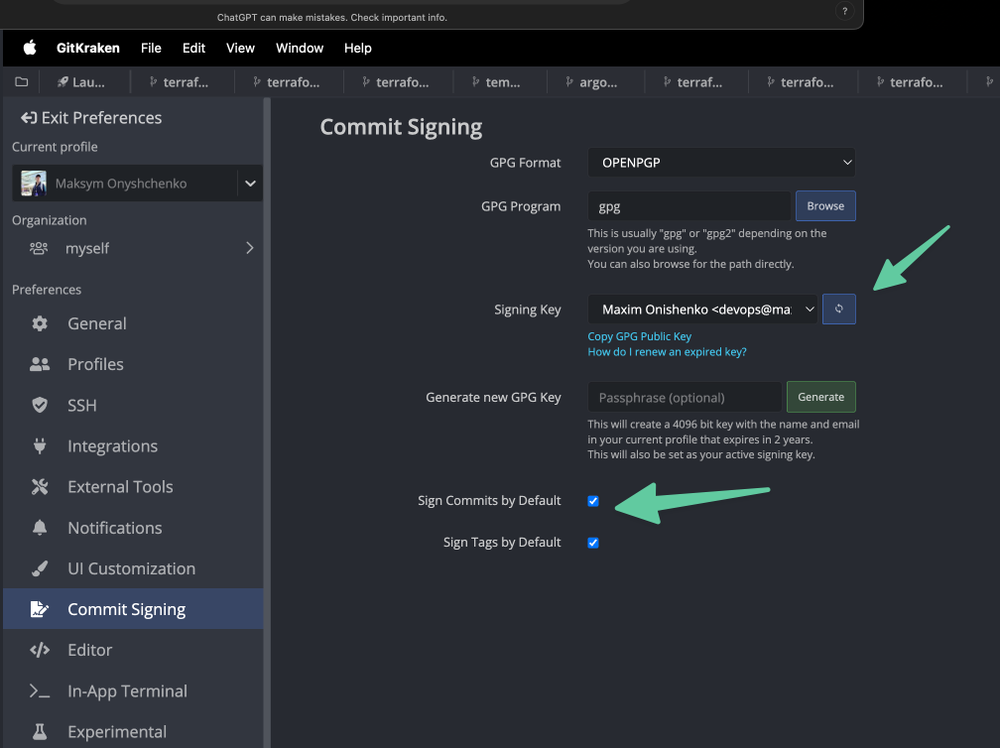

## Configure GPG key if they are requried
- Install https://gpgtools.org/ 
- Generate a new key
- Copy the public key  

- Paste the public key in Github settings  

- Copy key id  

- `git config --global  user.signingkey <key id> `  
- `git config --global commit.gpgsign true`

Do not delete expireted keys. Commits signed with deleted keys will be marked as unverified.  

### If using visual git clients
#### GitKraken

